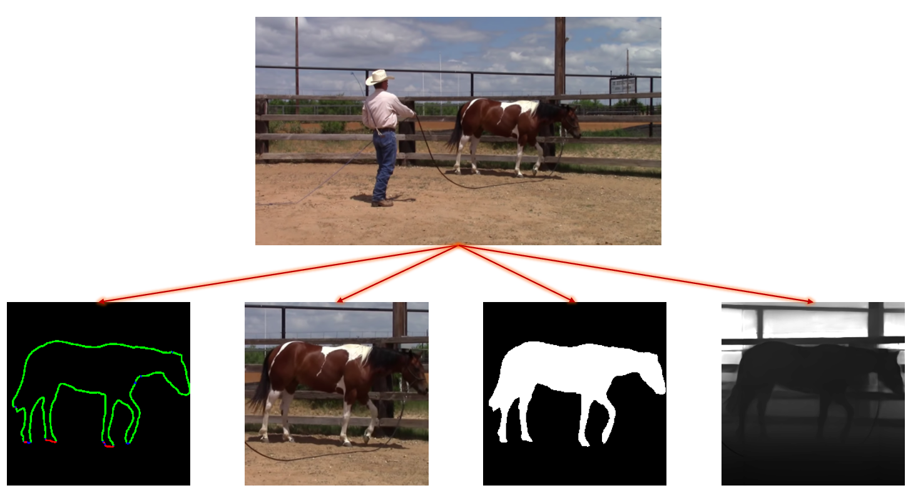

# Video Object Processing (VoP)

## Overview
**VoP** is a robust video preprocessing toolkit designed for dataset creation, developed as part of my Master's Thesis at SVLab, Stanford University. The toolkit processes raw videos containing objects of interest (e.g., animals) and generates datasets featuring trajectories of these objects, complete with depth maps, masks, occlusion boundaries, and DINO features. It supports processing multiple videos and tracking multiple objects of interest within the same video.

<div align="center">
  
</div>

## Installation

### Prerequisites
Ensure that your system meets the following requirements:
- **CUDA Environment:** If you have a CUDA-capable GPU, ensure that the `CUDA_HOME` environment variable is set. Without this, the toolkit will compile in CPU-only mode, which may significantly affect performance.

#### Checking CUDA Installation
Run the following command to check if `CUDA_HOME` is set:
```bash
echo $CUDA_HOME
```

If nothing prints, your CUDA path isn't set. Configure it by running:
```bash
export CUDA_HOME=/path/to/cuda-11.3
```
Ensure that the CUDA version aligns with your CUDA runtime. 

#### Create and Activate the Environment
Execute the following commands to set up the Conda environment:
```bash
conda env create --file environment.yml
conda activate vop
```
#### Troubleshooting Common Installation Issues

If you encounter errors such as:
```bash
NameError: name '_C' is not defined
```

This typically indicates a problem with the environment setup. To resolve this, reinstall the repository by re-cloning the Git repository and repeating the installation steps.


#### Downloading Pretrained Models

```bash
cd externals/GroundingDINO
pip install -e .
mkdir weights
cd weights
wget -q https://github.com/IDEA-Research/GroundingDINO/releases/download/v0.1.0-alpha/groundingdino_swint_ogc.pth
cd ../..

cd RAFT
./download_models.sh
cd ../../..
```

## Usage

### Setup

Assuming all videos are located in the following path:

/.../base_dir/horse_new

The pipeline is divided into three main stages to manage the heavy and computationally intensive tasks efficiently.

### First Stage

#### Objective
In this stage, the primary goals are to compute the depth maps for the video frames and to track the trajectories of the objects of interest.

#### Configuration
Update the configuration settings in `configs/config_1st_stage.yml`:
- `base_path` should be set to `/.../base_dir`
- `curr_folder` should be set to `horse_new`

Additional fields in the config file are explained within the file itself, providing guidance on further customization.

#### Execution
Run the first stage using the following command:
```bash
python -m scripts.preprocess_1st_stage --config configs/config_1st_stage.yml
```

#### Expected Output

Assuming your directory and videos are structured as follows:

base_dir/
├── horse_new/
│   ├── AAAAA.mp4
│   └── BBBBB.mp4

After running the first stage, the structure will be updated to:

base_dir/
├── horse_new/
│   ├── AAAAA/
│       ├── all_AAAAA_clips_after_1st_stage
│           ├── 00000 #trajectory 00000
│               ├── mask, metadata, occlusion for each frame in the trajectory
│           ├── 00001 #trajectory 00001
│               ├── ...
│       ├── all_depth_maps/
│           ├── 0000000.png #depth map of frame 0
│           ├── 0000001.png
│           ├── ...
│   ├── BBBBB/
│       ├── same as AAAAA...


## Second Stage

### Objective
The second stage of the pipeline focuses on refining the trajectories generated in the first stage by removing faulty detections and filtering out frames with certain conditions:
- It discards frames where the object of interest is occluded.
- It ignores frames where there is minimal movement between consecutive frames, determined using optical flow.
- The trajectory is smoothed by adjusting the crop between consecutive frames to avoid abrupt movements that can lower performance in subsequent tasks.

### Execution
Run the second stage with the following command:
```bash
python -m scripts.preprocess_2nd_stage --config configs/config_2nd_stage.yml
```

#### Expected Output

After processing with the second stage, the directory structure will be updated as follows:


base_dir/
├── horse_new/
│   ├── AAAAA/
│       ├── all_AAAAA_clips_after_1st_stage
│       ├── all_AAAAA_clips_after_2nd_stage
│           ├── 00000 #trajectory 00000
│               ├── cropped mask, metadata, occlusion, rgb image and depth map for each frame in the trajectory (after filtering out)
│           ├── 00001 #trajectory 00001
│               ├── ...
│       ├── all_depth_maps/
│   ├── BBBBB/
│       ├── same as AAAAA...


## Building the Dataset

### Preparation
Before proceeding to the third stage, it's essential to compile the training and testing datasets using the `build_dataset.py` script. This script segregates the trajectories into training and testing datasets based on the specified percentage.

### Execution
Run the following command to build the dataset:
```bash
python scripts/build_dataset.py --base_dir /.../base_dir/horse_new --train_perc 0.8 --out_dir /.../Final
```

#### Expected Output

After executing the script, the datasets will be organized into training and testing directories as follows:

Final
├── train/
│   ├── 00000/ 
│   ├── 00002/
│   ├── 00003/
│   ├── .../
│       
├── test/
│   ├── 00001/ 
│   ├── 00004/
│   ├── .../

where each folder contains a trajectory from the 2nd stage.


## Third Stage

### Objective
The third stage of the pipeline is dedicated to extracting DINO features from the cropped images obtained in the previous stages. This process includes the use of PCA (Principal Component Analysis) for feature projection, enhancing the usefulness of the features for machine learning tasks.

### Execution
To extract DINO features, execute the following command, specifying the configuration for the third stage:
```bash
python -m scripts.preprocess_3rd_stage --config configs/config_3rd_stage.yml
```

#### Expected Output
After running it on the /.../Final folder, DINO features will be added for each frame in the folders.


